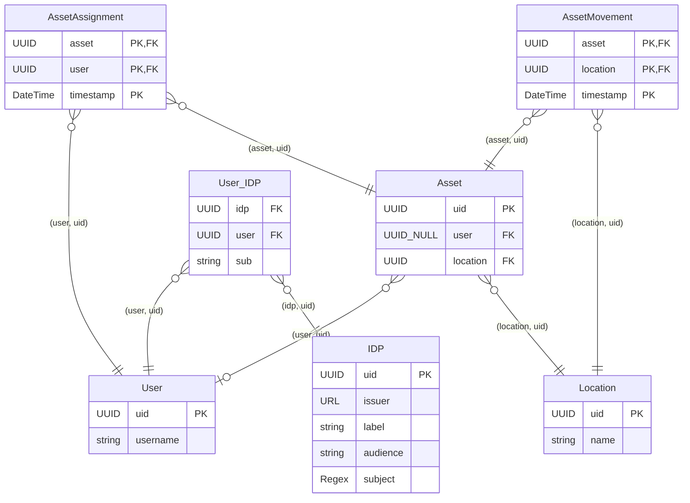

# ER Diagram

```mermaid
erDiagram
	User {
		UUID uid PK
		string username
	}
	Asset {
		UUID uid PK
		UUID_NULL user FK
		UUID location FK
	}
	Location {
		UUID uid PK
		string name
	}
	IDP {
		UUID uid PK
		URL issuer
		string label
		string audience
		Regex subject
	}
	User_IDP {
		UUID idp FK
		UUID user FK
		string sub
	}
	AssetMovement {
		UUID asset PK,FK
		UUID location PK,FK
		DateTime timestamp PK
	}
	AssetAssignment {
		UUID asset PK,FK
		UUID user PK,FK
		DateTime timestamp PK
	}


	User_IDP many to one IDP : "(idp, uid)"
	User_IDP many to one User : "(user, uid)"

	Asset many to one Location : "(location, uid)"
	Asset many to zero or one User : "(user, uid)"

	AssetMovement many to one Location : "(location, uid)"
	AssetMovement many to one Asset :"(asset, uid)"

	AssetAssignment many to one Asset : "(asset, uid)"
	AssetAssignment many to one User : "(user, uid)"

```
