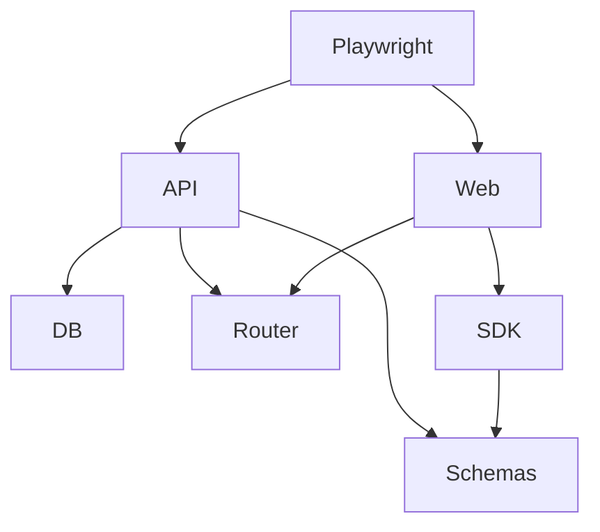
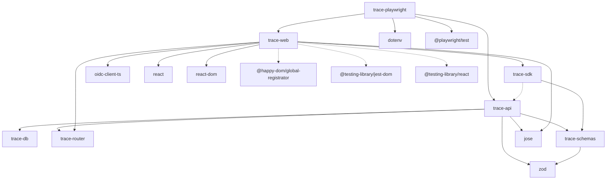

# Workspace Packages

# Direct Dependencies
- Omitting `@types/*` packages, as they do not add any functionality.
- Omitting `typescript` package, as everything would depend on it.
- Uses dashed lines for `devDependencies`.

